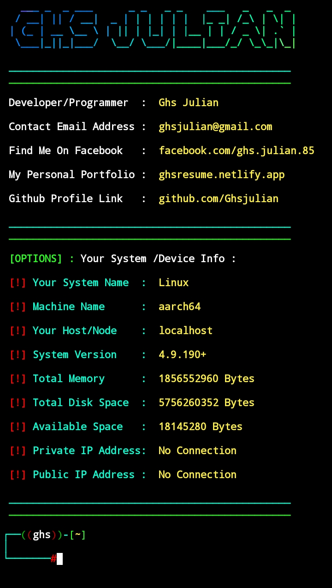

# Developer Ghs Julian 

## Termux Tools 

--- 


**Hello user, welcome to my termux tools . This tools has designed for more easily use for users . This is really awesome if you are willing to install this Repository please follow the commands bellow.**

---

## Command To Clone : 
```
git clone https://github.com/Ghsjulian/Termux-Tools.git
cd Termux-Tools
bash install.sh
```
---

### Wow You Have Successfully Installed This Tools

## Tools For Use : 
This Tool Has Already Installed That Package Which You Need Everytime
## Packages Installed  : 

--- 

```
[1] Nodejs
[2] Python
[3] Ruby
[4] Figlet
[5] Wget
[6] Curl
[7] PHP
[8] MariaDB
[9] PhpMyAdmin
[10] GIT
```
## How To Use Commands : 
```
[1] php-server
[2] phpmyadmin
[3] python-server
[4] acode_terminal
[5] htdocs


```

---
--- 

## Demo & Screenshots : 
<center>
  
  <br/><br/>
  <h2>Thank You 🙏❤️ </h2>
</center>
